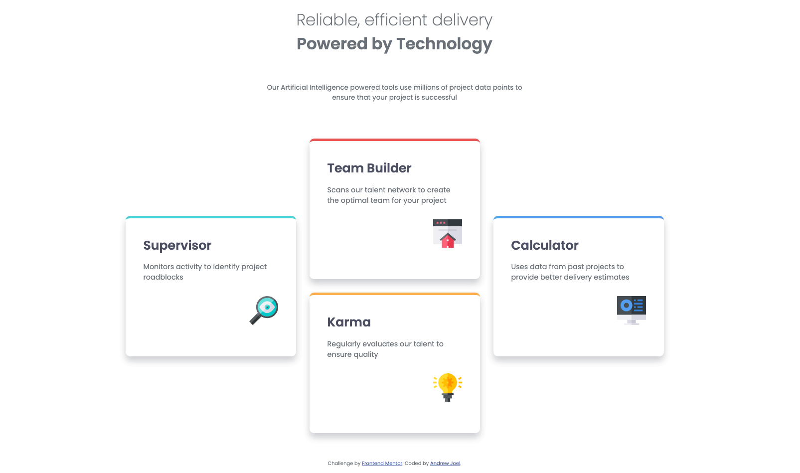
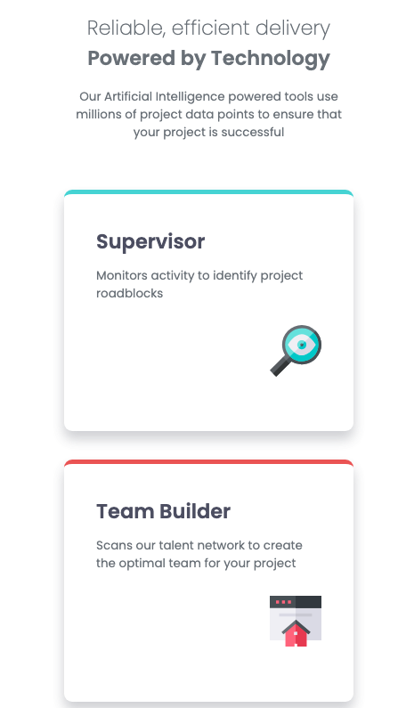
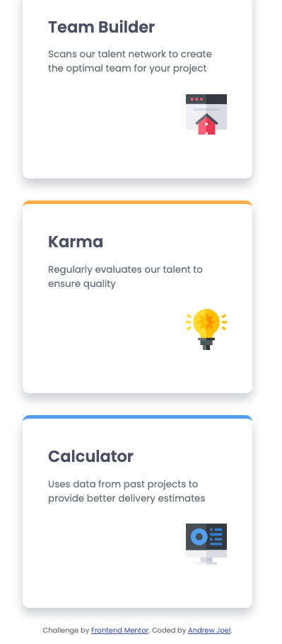

## Table of contents

- [Overview](#overview)
  - [Screenshot](#screenshot)
  - [Links](#links)
- [My process](#my-process)
  - [Built with](#built-with)
  - [What I learned](#what-i-learned)
  - [Continued development](#continued-development)
- [Author](#author)
- [Acknowledgments](#acknowledgments)

## Overview

### Screenshot

### Links

- Solution URL: [AR_four-card-feature-section-master](https://github.com/andrewxrojas/AR_four-card-feature-section-master.git)
- Live Site URL: [Live site](https://andrewxrojas.github.io/AR_four-card-feature-section-master/)

## My process

### Built with

- Semantic HTML5 markup
- CSS custom properties

### What I learned

I learned how to use grid systems for complex layouts.  After this challenge, I can easily visualize container placement on grids
fasdfa
### Continued development

I want to continue learning about CSS styles, media query, and responsive layouts as I feel that these are important skills to learn in order to make a user friendly design.

## Author

- Website - [Andrew Joel](https://www.andrewxrojas.com)
- Frontend Mentor - [@andrewxrojas](https://www.frontendmentor.io/profile/andrewxrojas)

## Acknowledgments

I'd like to thank Frontend Mentor for providing these type of challenges. These challenges are very helpful and I'm very grateful for these opportunities.